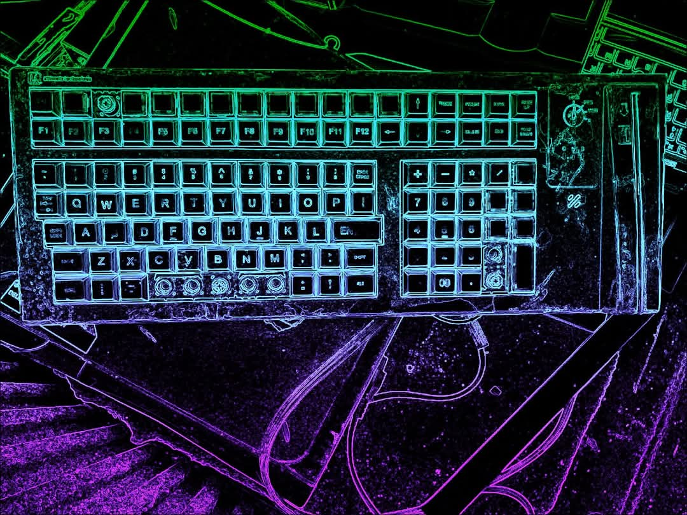

# Xylomancy

# *Good at Computers*

In the future, if I ever get good at computers, I will build a robot army of virtual scholars to read pdfs and watch movies and listen to audiobooks for me, and to give me summaries.

Examples:
Computer, read these ten thousand articles and pick out the good parts and then give me a five minute report in Spanish at 3 o'clock.

Computer, where are my wallet and keys?

Computer, execute complete shutdown of the holodeck.

*December 6, 2019*

<!--

-->
